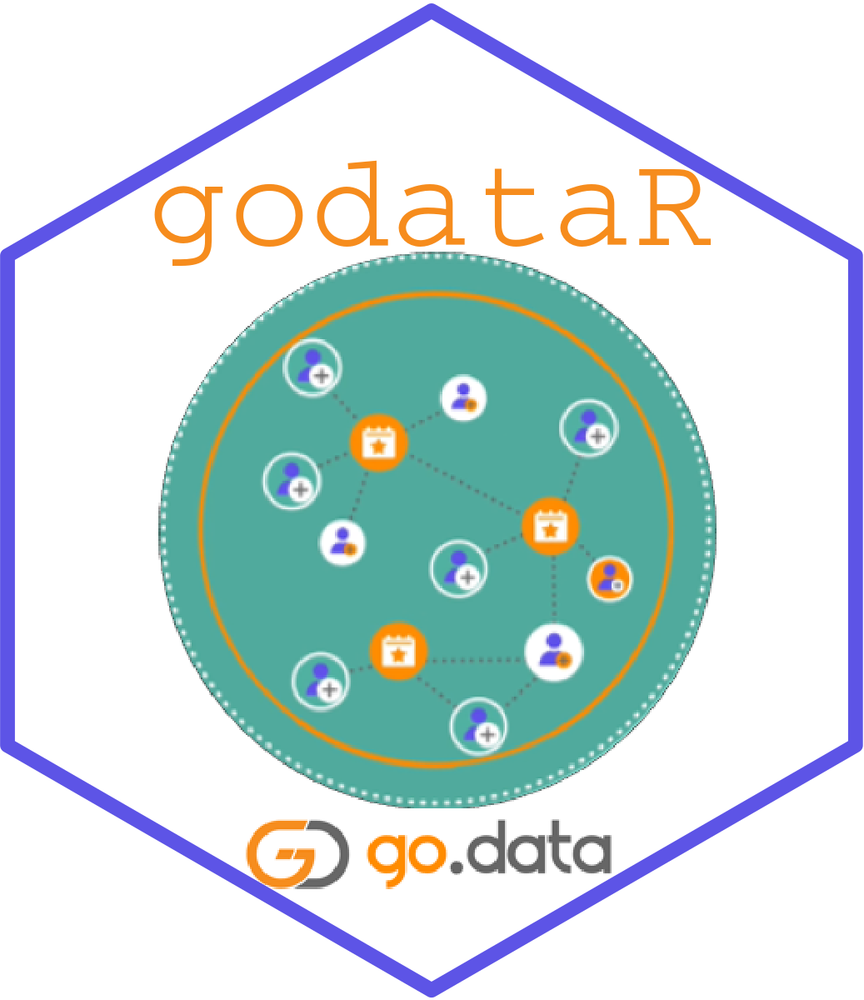

godataR: easier wrangling with the Go.Data API

================
05 October 2022

<!-- README.md is generated from README.Rmd. Please edit that file -->

## Overview

[Go.Data](https://www.who.int/tools/godata) is a software for outbreak
response and contact tracing developed by WHO in collaboration with
partners in the Global Outbreak Alert and Response Network (GOARN).
Go.Data focusses on case and contact data including laboratory data,
hospitalization and other variables collected through investigation
forms. It generates contact follow-up lists and allows visualisation of
chains of transmission.

The `godataR` package was built to allow the Go.Data [user
community](https://community-godata.who.int/) to more easily retrieve or
send data from or to a particular instance of Go.Data via its API,
especially when dealing with large volumes of data. You can now quickly
retrieve a database colleciton in an un-nested format for further
cleaning and analysis with one line of R code.

For example, the functions `get_cases()` or `get_locations()` provides a
painless way to retrieve case data or hierarchical locations by
bypassing all of the normal API syntax and authenticating with Go.Data
user login credentials from objects already stored in the R environment.

Users can also retrieve cases or laboratory records that fall within a
specific date range, using `get_cases_epiwindow()` or
`get_labresults_epiwindow()` respectively.

It is now possible to create a Go.Data bulk import-ready file of new or
updated laboratory records matched to cases or existing lab records in
Go.Data respectively, using the `lab2godata_wrapper()` function. If
preferred, users not familiar with R can enter the parameters for this
function by using the `lab2godata` shiny app. The app can be launched
from within the godataR package with `runlab2godata()`.

Future iterations will focus on POSTing to the Go.Data API for bulk
creation or modification of case, contact and lab records.

## Installation

This package is hosted on the WHO Github Repository here:
<https://github.com/WorldHealthOrganization/godataR>. Install the
package within your R console by executing the code below.

``` r

# Install package
devtools::install_github("WorldHealthOrganization/godataR")
```

## Usage

### Provide parameters (your Go.Data credentials):

You must have valid Go.Data user credentials with appropriate
roles/permissions to successfully receive an access token to make any
API calls. You can set your parameters at the outset of your R session,
to call them more easily when fetching your collections. You can also
specify ad-hoc if you are working across various outbreaks.

``` r

### Set Go.Data login credentials:

# Load libraries:
library(getPass)
library(godataR)

# Your Go.Data URL
url <- "https://MyGoDataServer.com/" 

# Your email address to log in to Go.Data
username <- getPass::getPass(msg = "Enter your Go.Data username (email address):") 

# Your password to log in to Go.Data
password <- charToRaw(getPass::getPass(msg = "Enter your Go.Data password:")) 

# Get ID for active outbreak:
outbreak_id <- godataR::get_active_outbreak(url = url, 
                                            username = username, 
                                            password = rawToChar(password))
```

## Execute functions to retrieve desired collections

### These collections require access to and specification of the outbreak ID:

``` r

# Get case data:
cases <- get_cases(url = url,
                   username = username, 
                   password = password, 
                   outbreak_id = outbreak_id)

# Get contacts data:
contacts <- get_contacts(url = url,
                         username = username, 
                         password = password,
                         outbreak_id = outbreak_id)

# Get contacts of contacts:
contacts_of_contacts <- get_contacts_of_contacts(url = url,
                                                 username = username,
                                                 password = password, 
                                                 outbreak_id = outbreak_id)

# Get lab results:
lab_results <- get_labresults(url = url, 
                              username = username, 
                              password = password,
                              outbreak_id = outbreak_id)

# Get relationships:
relationships <- get_relationships(url = url,
                                   username = username,
                                   password = password,
                                   outbreak_id = outbreak_id)

# Get follow-ups:
followups <- get_followups(url = url, 
                           username = username, 
                           password = password, 
                           outbreak_id = outbreak_id)

# Get events:
events <- get_events(url = url, 
                     username = username, 
                     password = password, 
                     outbreak_id = outbreak_id)

# Get clusters:
clusters <- get_clusters(url = url,
                         username = username,
                         password = password,
                         outbreak_id = outbreak_id)

# Match new lab results to cases in Go.Data within a date window:

# - lab results are read in to a data.frame called 'newlab'
# - cases will be matched to lab results if the case report date is within 30 
#   days of the specimen collection date in the lab data (epiwindow)
# - Cases and lab results will be matched with fuzzy matching on names & dob
# - The relevant column names from lab data to use when matching are supplied;
#   (in this case first name, last name and date of birth)

# Read in example lab data (included in godataR package):
newlab <- rio::import(system.file("extdata", 
                                  "Lab_results_new.xlsx", 
                                  package = "godataR"))

# Run lab2godata_wrapper to match Go.Data cases to lab data:
labmatched <- godataR::lab2godata_wrapper(url = url,
                                          username = username,
                                          password = password,
                                          outbreak = "active",
                                          reason = "link new",
                                          daterangeformat = "ymd",
                                          epiwindow = 30,
                                          method = "fuzzy",
                                          matchcols = "names & dob",
                                          labdata = newlab,
                                          basedatecol = "sample_collection_date",
                                          firstnamecol = "firstname",
                                          lastnamecol = "surname",
                                          dobcol = "birthdate")
```

### The below collections are outbreak-agnostic and applied at system-level:

Note that some require extra parameters, like language tokens (*specify
“english_us” for English, otherwise find your token_id in the URL when
the language token is selected in the web-app*).

``` r

# Get users:
users <- get_users(url = url, 
                   username = username, 
                   password = password) 

# Get teams:
teams <- get_teams(url = url, 
                   username = username, 
                   password = password)

# Get locations:
locations <- get_locations(url = url, 
                           username = username, 
                           password = password)

# Get reference data:
reference_data <- get_reference_data(url = url, 
                                     username = username, 
                                     password = password)

# Get language tokens:
language_tokens <- get_language_tokens(url = url, 
                                       username = username, 
                                       password = password, 
                                       language = "english_us")
```

## Handling versioning across Go.Data releases:

There were significant changes to most API endpoints at the release of
V38.1, in order to increase performance during export and in-app
visualization. There are two methods for downloading the data to
accomodate version history:

-   `method = "export"` will only work on Go.Data versions 2.38.1 or
    newer. This method relies on the `GET outbreak/{id}/cases/export`
    API endpoint. An export request is submitted to the server, and then
    when the export is ready, it will be downloaded. Due to better
    performance and more options, `method = "export"` will be the
    default if you are using Go.Data version 2.38.1 or newer.
-   `method = "batches"` will work on all versions of Go.Data. This
    method relies on the API endpoints such as `GET outbreak/{id}/cases`
    or `GET outbreak/{id}/contacts` API endpoint. Records are then
    retrieved in batches based on `batch_size` and appended together
    into a final dataset. `method = "batches"` will be the default and
    only available method for Go.Data version 2.38.0 or older.

We recommend always upgrading to the latest Go.Data version to benefit
from ongoing performance enhancements, when handling large amounts of
data.

## API documentation:

Go.Data is running on [LoopBack](https://loopback.io/doc/index.html).
You can access the self-documenting description of all available API
methods in using Loopback Explorer by adding `/explorer` to the end of
any Go.Data URL.

You can find more information on the Go.Data API
[here](https://worldhealthorganization.github.io/godata/api-docs/).

## How to provide feedback or contribute:

Bug reports and feature requests should be posted on github under
[*issues*](https://github.com/WorldHealthOrganization/godataR/issues).
All other questions and feedback, feel free to email us at
<godata@who.int> or post a query in the [Go.Data Community of
Practice](https://community-godata.who.int/)

Contributions are welcome via pull requests.
